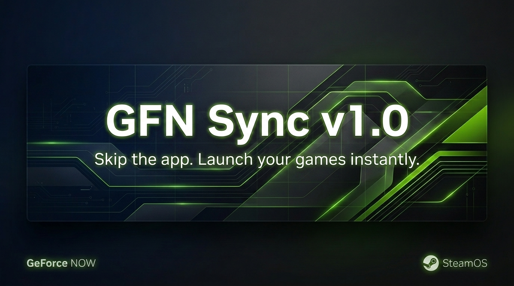

# 🎮 GFN Sync

**Automatically sync your GeForce NOW library to Steam on SteamOS.**

GFN games appear as non-Steam shortcuts in your Steam library, categorized under "GeForce NOW", and launch directly into the game via the official NVIDIA client.

[](https://store.steampowered.com/steamos)
[](https://python.org)
[](LICENSE)
[]()

---

## ✨ Features

- 🔍 **Auto-detection** of GeForce NOW clients (official NVIDIA Flatpak + community Electron clients)
- 📚 **Library extraction** from GFN's CacheStorage (official) and LevelDB (community)
- 🎯 **Smart selection** — 2-step wizard: filter by store (Steam, Epic, Ubisoft...), then pick individual games
- 🚀 **Direct launch** — games start directly in GeForce NOW via `--url-route` (no extra clicks)
- 🖼️ **Native artworks** — game covers, heroes & logos extracted directly from the GFN cache and NVIDIA CDN (no API key needed)
- 🏷️ **Categorized** — all shortcuts tagged "GeForce NOW" for easy filtering in Steam
- 🧹 **Cleanup tool** — selectively remove GFN shortcuts and their artworks
- 🎮 **Steam Input fix** — enables controller passthrough for special peripherals (Yoke, HOTAS...)
- 🖥️ **GUI + Terminal** — native KDE dialogs (kdialog) with full terminal fallback
- 📦 **Zero dependencies** — pure Python 3 stdlib, no `pip install` required

---

## 📦 Installation

### Option A — Téléchargement direct (recommandé, aucune commande)

1. Allez sur [**Releases**](https://github.com/supernebuleux/GFNOW-SYNC/releases) et téléchargez `GFNOW-SYNC.tar.gz`
2. **Clic-droit** sur le fichier → **Extraire ici** (l'extracteur Ark de KDE crée un dossier `gfn-sync/`)
3. Ouvrez le dossier `gfn-sync/`
4. **Double-cliquez** sur **`Install GFN Sync`** (l'icône en forme de terminal)
5. L'installation se lance dans Konsole. C'est fini ✅

> [!TIP]
> **Où retrouver l'app après installation ?**
>
> #### En mode Bureau (Desktop Mode)
> Cliquez sur le **menu KDE** (coin bas-gauche) → tapez **« GFN Sync »** dans la barre de recherche → cliquez sur l'app.
>
> #### En mode Gaming (Game Mode)
> L'app n'apparaît pas dans Game Mode. Lancez-la depuis le **mode Bureau**, puis retournez en Game Mode : vos jeux GFN seront dans votre bibliothèque Steam sous la catégorie **« GeForce NOW »**.

### Option B — Via Git (pour développeurs)

```bash
git clone https://github.com/supernebuleux/GFNOW-SYNC.git
cd GFNOW-SYNC
bash install.sh
```

---

## 📋 Prerequisites

| Requirement | How to check | If missing |
|---|---|---|
| **Python 3** | `python3 --version` | Pre-installed on SteamOS |
| **GeForce NOW** (Flatpak) | `flatpak list \| grep -i geforce` | Install from [nvidia.com](https://www.nvidia.com/geforce-now/download/) or Discover |
| **GFN account signed in** | Open the GFN app and verify | Sign in and link your stores |
| **GFN library cached** | Browse "Library" tab in GFN app | Scroll through your games to cache them locally |

> [!CAUTION]
> **Close Steam AND GeForce NOW** before running the sync script.
> Steam overwrites `shortcuts.vdf` when it closes — if Steam is running, your changes will be lost.

---

## 🚀 Usage

### From the app menu (recommended)

After installation, open the **KDE app menu** (bottom-left corner) and search for **"GFN Sync"**.

A menu will appear with three options:

| Option | Description |
|---|---|
| 🔄 **Sync Library** | Interactive wizard to add GFN games to Steam |
| 🧹 **Cleanup** | Remove GFN shortcuts from Steam |
| 🎮 **Fix Steam Input** | Enable controller passthrough (Yoke, HOTAS...) |

### From the terminal

```bash
cd ~/gfn-sync
python3 gfn_sync_library.py   # Sync
python3 gfn_cleanup.py         # Cleanup
python3 gfn_steam_input_fix.py # Steam Input fix
```

### Sync wizard walkthrough

1. Detects your GeForce NOW client
2. Extracts your game library from the GFN cache
3. Lets you filter by store (Steam, Epic, Ubisoft, Xbox, EA, GOG...)
4. Lets you pick individual games
5. Closes Steam, writes the shortcuts, downloads artworks automatically
6. Restarts Steam — your games are ready 🎮

---

## 🔧 How It Works

### Game Extraction

The official GeForce NOW client stores your library in the **CacheStorage** of its Service Worker (CEF engine):

```
~/.var/app/com.nvidia.geforcenow/.local/state/NVIDIA/GeForceNOW/
  CefCache/Default/Service Worker/CacheStorage/
```

GFN Sync scans these binary files, extracts JSON game data, and filters for games with `"selected": true` (= in your library).

### Native Artworks (zero API key)

Game covers are retrieved automatically in two stages:

1. **Local cache extraction** — images are carved directly from the Chromium Simple Cache binary files (100% offline)
2. **NVIDIA CDN download** — image URLs extracted from the GFN data are fetched from NVIDIA's servers (free, no account needed)

No SteamGridDB API key, no developer account — it just works.

### Direct Launch

Games are launched using a method discovered via reverse-engineering:

```bash
flatpak run --command=sh com.nvidia.geforcenow -c \
  "/app/cef/GeForceNOW --url-route='#?cmsId=XXX&launchSource=External&shortName=YYY&parentGameId=ZZZ'"
```

> **Note:** `--direct-start` (the documented method) does NOT work with the official Flatpak.

### Steam Integration

Shortcuts are written to `shortcuts.vdf` using **signed int32** encoding (critical — unsigned int32 causes Steam to reject the file). The bundled `vdf/` module handles this correctly with zero external dependencies.

---

## 🗂️ Project Structure

```
gfn-sync/
├── gfn_common.py            # Shared backend: extraction, VDF, GUI, Steam management
├── gfn_sync_library.py      # Main sync wizard
├── gfn_cleanup.py           # Shortcut removal tool
├── gfn_steam_input_fix.py   # Controller passthrough fix
├── gfn-sync.sh              # Bash launcher menu
├── gfn-sync.desktop         # KDE app menu entry
├── install.sh               # SteamOS installer
├── Install GFN Sync.desktop # Double-click installer (for archives)
├── vdf/                     # Embedded binary VDF module (zero dependencies)
│   ├── __init__.py
│   └── vdict.py
├── LICENSE                  # MIT License
└── README.md
```

---

## ❓ Troubleshooting

| Problem | Solution |
|---|---|
| *"GFN Sync" doesn't appear in menu* | Run `chmod +x ~/.local/share/applications/gfn-sync.desktop` then log out/in, or search "GFN" in the KDE menu |
| *"GeForce NOW cache not found"* | Open GFN app, browse your Library tab, close it, retry |
| *"No games found"* | Check that your stores are linked in GFN (Settings → Connections) |
| *Shortcuts don't appear in Steam* | Make sure Steam was closed before running the script. Restart Steam |
| *Missing game artwork* | Artworks are downloaded automatically from GFN cache/CDN. If some are missing, you can add custom images manually in `~/.steam/steam/userdata/<id>/config/grid/` |
| *Controller not working in GFN* | Run `gfn_steam_input_fix.py`, then configure the controller mapping in Steam's controller settings for the game |
| *"Permission denied"* | Run `chmod +x ~/gfn-sync/*.py ~/gfn-sync/gfn-sync.sh` |
| *kdialog not available* | Normal on non-KDE systems. The terminal fallback works identically |

---

## 🔄 Re-syncing

The sync script is **idempotent** — run it as many times as you want:
- Existing games are **updated** (no duplicates)
- New games are **added**
- Removed games stay as shortcuts (use `gfn_cleanup.py` to remove them)

---

## 🗺️ Roadmap

| Version | Status | Highlights |
|---|---|---|
| **v1.0** | ✅ Done | Full sync, direct launch, interactive wizard, installer |
| **v1.1** | ✅ Done | Native artworks (zero API key), double-click installer |
| **v1.2** | 🔜 Next | Game Mode launcher, incremental sync, uninstaller |
| **v2.0** | 💡 Future | Multi-backend (community + browser), multi-profile, import/export |

---

## 🤝 Contributing

Contributions are welcome! Feel free to:

1. Fork the repository
2. Create a feature branch (`git checkout -b feature/my-feature`)
3. Commit your changes (`git commit -m 'Add my feature'`)
4. Push to the branch (`git push origin feature/my-feature`)
5. Open a Pull Request

---

## 📄 License

[MIT](LICENSE) — open source, simple, permissive.

---

## 🇫🇷 En français

GFN Sync synchronise automatiquement ta bibliothèque GeForce NOW avec Steam sur SteamOS.
Tes jeux GFN apparaissent comme raccourcis non-Steam, catégorisés « GeForce NOW », et se lancent directement dans le jeu via le client officiel NVIDIA.

**Installation sans ligne de commande :** télécharge l'archive depuis [Releases](https://github.com/supernebuleux/GFNOW-SYNC/releases), extrais, double-clique sur « Install GFN Sync ». Ensuite, cherche « GFN Sync » dans le menu KDE (coin bas-gauche).

---

*Made with ❤️ for the Steam Deck community*
